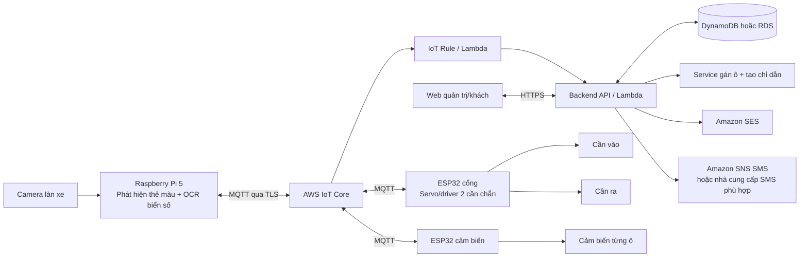

# Hệ thống bãi đỗ xe thông minh — kế hoạch dự án

> Bản khung ban đầu dựa trên mô tả trong hội thoại. Cần đối chiếu và bổ sung chi tiết từ DOCX khi nội dung tài liệu được đọc/đưa vào workspace.

## 1. Mục tiêu

Xây dựng mô hình bãi đỗ xe có thể:

- Nhận biết ý định **xe vào** hoặc **xe ra** từ thẻ màu xanh/đỏ được đưa trước camera.
- Đọc biển số bằng camera nối với Raspberry Pi 5 (ANPR/OCR).
- Điều khiển hai cần chắn tại cổng vào và cổng ra bằng ESP32.
- Theo dõi trạng thái từng ô đỗ bằng cảm biến nối với ESP32 cảm biến.
- Gán một ô phù hợp còn trống cho xe vào và hướng dẫn khách đến ô đó.
- Gửi thông báo cho khách qua email hoặc SMS khi có thông tin cần thiết.
- Có màn hình quản trị theo dõi xe, chỗ trống, sự kiện và trạng thái thiết bị.

## 2. Phạm vi MVP

### Làm trong phiên bản đầu

1. Một camera tại làn cổng, Raspberry Pi 5 xử lý ảnh/thẻ màu và OCR biển số.
2. Hai cần chắn mô hình: cổng vào và cổng ra; ESP32 nhận lệnh và điều khiển servo/driver.
3. Các cảm biến hiện diện cho từng ô; ESP32 tổng hợp và gửi trạng thái.
4. Backend lưu xe, phiên đỗ, trạng thái ô, sự kiện và thông tin liên hệ.
5. Quy tắc gán ô đơn giản: chọn ô trống phù hợp có khoảng cách đi bộ/đường nội bộ ngắn nhất.
6. Thông báo email trước; SMS là kênh bổ sung sau khi xác nhận chi phí, vùng gửi và cấu hình nhà cung cấp.
7. Giao diện web tối thiểu: sơ đồ ô, danh sách phiên đỗ và nhật ký thiết bị.

### Chưa cam kết trong MVP

- Thanh toán, đặt chỗ trước, nhận diện nhiều làn/camera, ứng dụng di động.
- Điều khiển cần chắn chỉ dựa trên kết quả AI. Mọi lệnh mở cần chắn phải qua kiểm tra trạng thái và có phương án dừng/đóng an toàn.

## 3. Kiến trúc đề xuất



### Trách nhiệm từng khối

| Khối | Trách nhiệm | Giao tiếp |
|---|---|---|
| Raspberry Pi 5 | Lấy khung hình; phát hiện xanh/đỏ; OCR biển số; gửi sự kiện có confidence và ảnh minh chứng nếu chính sách cho phép | MQTT/TLS đến AWS IoT Core |
| ESP32 cổng | Điều khiển hai cần chắn, đọc công tắc hành trình/trạng thái, nhận lệnh mở/đóng có thời hạn | MQTT/TLS đến AWS IoT Core; nếu firmware/credential hạn chế thì qua gateway Pi |
| ESP32 cảm biến | Đọc cảm biến ô đỗ, lọc nhiễu và phát trạng thái có timestamp | MQTT/TLS đến AWS IoT Core |
| AWS IoT Core | Kết nối thiết bị, xác thực certificate, định tuyến topic và lệnh | MQTT; IoT Rules |
| Backend | Kiểm tra sự kiện, quản lý phiên đỗ, gán ô, lưu lịch sử và điều phối thông báo | API, DB, SES/SNS |
| Web | Hiển thị sơ đồ chỗ đỗ, hướng dẫn, lịch sử và trạng thái thiết bị | HTTPS/WebSocket tùy nhu cầu |

> Gợi ý thiết kế: để Pi/backend là nơi xác nhận quyết định nghiệp vụ. ESP32 chỉ nhận lệnh điều khiển đã được xác thực; cảm biến gửi sự thật hiện trường. Không để màu thẻ một mình quyết định mở cần chắn.

## 4. Luồng nghiệp vụ

### Xe vào (thẻ xanh)

1. Camera/Pi phát hiện thẻ xanh ổn định trong vài khung hình, chụp vùng biển số và OCR.
2. Pi gửi `vehicle.entry_detected` gồm `event_id`, `plate`, `confidence`, `timestamp`, `lane_id`.
3. Backend kiểm tra độ tin cậy, xe đã có phiên mở hay chưa, còn ô trống không.
4. Service gán ô chọn ô đang trống, phù hợp loại xe/quyền ưu tiên (nếu có), rồi tạo hướng dẫn.
5. Backend gửi lệnh mở cần vào có `command_id` và thời hạn; ESP32 xác nhận trạng thái cần.
6. Khi cảm biến ô báo có xe, backend cập nhật phiên đỗ thành `PARKED` và chốt gán ô. Có timeout nếu xe không đến ô.
7. Gửi thông báo: “Biển số …, vui lòng đến ô B07. Đi theo lối …”.

### Xe ra (thẻ đỏ)

1. Pi nhận thẻ đỏ, OCR biển số và gửi `vehicle.exit_requested`.
2. Backend tìm phiên đỗ đang mở theo biển số; nếu OCR không chắc chắn thì yêu cầu xác nhận thủ công.
3. Gửi lệnh mở cần ra; chỉ đóng phiên khi cảm biến/cổng xác nhận xe đã qua theo logic mô hình.
4. Cập nhật ô thành `AVAILABLE` khi cảm biến xác nhận ô đã trống; gửi hóa đơn/thông báo nếu phạm vi có tính phí.

### Quy tắc an toàn và độ tin cậy

- Màu thẻ phân loại hành động, còn biển số là định danh xe; cần có bước ghép đúng sự kiện/camera/làn.
- Chống gửi lặp bằng `event_id` và `command_id` idempotent.
- Nếu OCR thấp confidence, mất mạng, cảm biến mâu thuẫn hoặc cần chắn không phản hồi: không tự cấp lệnh mở; hiển thị trạng thái cần xử lý thủ công.
- ESP32 nên có giới hạn hành trình, timeout, trạng thái fail-safe và nút dừng; không cấp nguồn servo/motor từ chân GPIO.
- Cảm biến ô: cân nhắc cảm biến siêu âm/ToF cho mô hình, hoặc cảm biến từ/IR phù hợp cách lắp. Cần hiệu chỉnh và lọc trạng thái nhấp nháy.

## 5. Thiết kế sự kiện và topic MQTT

Topic gợi ý:

```text
parking/v1/pi-gate-01/events
parking/v1/gate-01/commands
parking/v1/gate-01/telemetry
parking/v1/sensors-01/slots
parking/v1/devices/+/status
```

Ví dụ sự kiện Pi:

```json
{
  "event_id": "uuid",
  "type": "vehicle.entry_detected",
  "lane_id": "entry-01",
  "plate": "51A-123.45",
  "plate_confidence": 0.91,
  "card_color": "green",
  "captured_at": "2026-09-30T10:15:00Z"
}
```

Ví dụ cập nhật ô:

```json
{
  "device_id": "sensor-board-01",
  "slot_id": "B07",
  "occupied": false,
  "confidence": 0.98,
  "observed_at": "2026-09-30T10:15:03Z"
}
```

Không đưa AWS access key cố định vào firmware. Mỗi thiết bị nên có Thing/certificate/policy riêng, chỉ được publish/subscribe topic cần thiết. Secret và quyền backend quản lý ở AWS, không nằm trong repository.

## 6. AWS gửi email/SMS như thế nào?

Thiết bị không cần tự gọi dịch vụ gửi tin. Thiết bị gửi sự kiện MQTT lên AWS IoT Core; IoT Rule/Lambda hoặc backend nhận sự kiện, tra thông tin liên hệ và gọi dịch vụ gửi thông báo.

### Email — lựa chọn đề xuất cho MVP

- Dùng **Amazon SES** qua AWS SDK/API từ backend/Lambda.
- Xác minh domain/email gửi, cấu hình DNS (SPF/DKIM/DMARC theo hướng dẫn), xin chuyển khỏi sandbox nếu cần gửi cho địa chỉ chưa xác minh.
- Lưu email khách trong hồ sơ/phiếu đăng ký, kiểm tra đồng ý nhận tin; không phát tán email trong log.
- Ví dụ: backend gán ô B07 → gọi SES gửi email chứa biển số đã che bớt, vị trí ô và chỉ dẫn.

### SMS

- Có thể dùng **Amazon SNS Publish** để gửi SMS đến số điện thoại hoặc chủ đề; backend/Lambda gọi API `Publish`.
- Cần cấu hình quyền gửi SMS, giới hạn chi tiêu, vùng/quốc gia, sender/origination identity và tuân thủ quy định nhà mạng. Kiểm tra khả năng giao đến Việt Nam/chi phí trước khi chọn làm kênh chính.
- Nếu SMS trực tiếp của AWS không phù hợp về hỗ trợ quốc gia, định danh gửi hoặc chi phí, dùng nhà cung cấp SMS có hỗ trợ tại Việt Nam; backend gọi API nhà cung cấp. AWS vẫn giữ vai trò xử lý sự kiện và điều phối.
- SMS thường tính phí theo tin/đích đến; email thường thuận tiện để thử nghiệm dự án hơn.

### Sơ đồ nối thông báo

```text
Pi/ESP32 --MQTT--> AWS IoT Core --Rule--> Lambda/Backend
                                         |-- đọc hồ sơ khách + phiên đỗ
                                         |-- gán ô và tạo chỉ dẫn
                                         |-- SES SendEmail --> email khách
                                         `-- SNS Publish/API nhà cung cấp --> SMS khách
```

### Chỉ dẫn vào ô

Với bãi mô hình, biểu diễn bãi thành các node/vị trí và các lối đi thành cạnh có trọng số. Service chọn ô trống hợp lệ có đường đi ngắn nhất bằng BFS (nếu các cạnh cùng độ dài) hoặc Dijkstra (nếu có độ dài/ưu tiên khác nhau). Có thể thêm tiêu chí phụ: dành ô gần lối ra cho người cần hỗ trợ, tránh giao cắt luồng xe, gom đầy một khu trước.

Kết quả API nên trả về dữ liệu có cấu trúc để app/web/email dùng chung:

```json
{
  "slot_id": "B07",
  "display_name": "Ô B07",
  "route_steps": ["Đi thẳng 8 m", "Rẽ phải", "Ô thứ 3 bên trái"],
  "map_url": "/parking/map?slot=B07"
}
```

Nếu gửi hướng dẫn qua SMS, giữ tin nhắn ngắn và có URL sơ đồ; email/web có thể hiển thị sơ đồ chi tiết hơn.

## 7. Khung thư mục repository

```text
.
├── README.md
├── PROJECT_PLAN.md
├── docs/
│   ├── architecture.md
│   ├── hardware-and-wiring.md
│   ├── mqtt-contract.md
│   ├── aws-setup.md
│   ├── simulation-and-test-plan.md
│   └── team-work-plan.md
├── firmware/
│   ├── esp32-gates/
│   └── esp32-slot-sensors/
├── edge/
│   └── raspberry-pi-vision/
├── backend/
├── web/
├── simulation/
│   ├── scenarios/
│   └── mock-devices/
└── infra/
    └── aws/
```

Tạo module theo từng giai đoạn; chưa cần dựng mọi thư mục rỗng ngay. Dùng `simulation/mock-devices` để phát MQTT giả lập trước khi phần cứng hoàn thiện.

## 8. Phân công 4 người

| Người | Phụ trách chính | Đầu việc | Bàn giao |
|---|---|---|---|
| Thành viên 1 — Vision/Edge | Camera + Raspberry Pi 5 | Phát hiện thẻ xanh/đỏ; OCR biển số; đo confidence; publish MQTT; công cụ phát lại video/ảnh để mô phỏng | Module Pi, schema sự kiện, video test đã ẩn dữ liệu nhạy cảm |
| Thành viên 2 — Phần cứng/firmware | ESP32 cổng và cần chắn | Mạch/driver, hai servo hoặc motor, công tắc hành trình, firmware nhận lệnh và báo trạng thái; thử an toàn cơ khí | Sơ đồ đấu nối, BOM, firmware, quy trình hiệu chỉnh |
| Thành viên 3 — Cảm biến + mô phỏng | ESP32 cảm biến ô + mô hình bãi | Chọn cảm biến, đọc/lọc nhiễu, mô phỏng trạng thái các ô; xây dựng sơ đồ vị trí/lối đi và thuật toán gán ô/chỉ đường | Firmware cảm biến, mô phỏng/mock MQTT, sơ đồ bãi và thuật toán |
| Thành viên 4 — Cloud/backend/app | AWS + backend + giao diện | AWS IoT Core, rule/Lambda/API, DB, logic phiên đỗ/thông báo SES (SNS thử nghiệm nếu khả thi), dashboard | Hạ tầng cấu hình, API, giao diện, hướng dẫn deploy và chi phí dự kiến |

### Việc chung

- Cả nhóm thống nhất schema MQTT/API và mã lỗi trước khi tích hợp.
- Thành viên 2 và 3 chốt điện áp, nguồn, chân GPIO, sơ đồ nguồn/chung mass cùng nhau.
- Thành viên 1 và 4 phối hợp định dạng biển số, ngưỡng confidence và luồng xác nhận thủ công.
- Mỗi người có README module, hướng dẫn chạy mô phỏng, và ít nhất một demo tích hợp.
- Một người trong nhóm làm điều phối/review luân phiên theo tuần; không để thành viên 4 vừa làm cloud vừa một mình gánh kiểm thử tích hợp.

## 9. Kế hoạch thực hiện theo mốc

1. **Tuần 1 — Chốt yêu cầu:** đọc DOCX, vẽ sơ đồ bãi/làn, thống nhất schema, chọn loại cảm biến và cơ cấu cần chắn.
2. **Tuần 2 — Mô phỏng:** mock Pi/ESP32 phát và nhận MQTT; backend giả lập gán ô; sơ đồ bãi; kiểm tra ba kịch bản vào/ra/lỗi.
3. **Tuần 3 — Phần cứng độc lập:** Pi nhận camera; ESP32 cổng chạy cơ cấu; ESP32 cảm biến đọc được từng ô.
4. **Tuần 4 — Tích hợp:** nối thiết bị với IoT Core/backend; xác thực certificate/policy; email thông báo; dashboard trạng thái.
5. **Tuần 5 — Hoàn thiện demo:** đo độ chính xác, độ trễ, xử lý mất Wi‑Fi/OCR kém/cảm biến lỗi; hoàn thiện tài liệu và video demo.

## 10. Kịch bản mô phỏng/tích hợp tối thiểu

| Kịch bản | Kết quả mong đợi |
|---|---|
| Thẻ xanh, biển số rõ, còn ô | Tạo phiên vào, gán một ô trống, mở cần vào, gửi chỉ dẫn |
| Thẻ đỏ, xe đang gửi | Tìm phiên đang mở, mở cần ra, giải phóng ô sau xác nhận cảm biến |
| Thẻ xanh nhưng bãi đầy | Không mở cần vào tự động; báo bãi đầy và ghi sự kiện |
| OCR confidence thấp | Chuyển trạng thái cần xác nhận; không gán nhầm phiên |
| Cảm biến nhấp nháy | Debounce/hysteresis; không đổi trạng thái liên tục |
| Mất kết nối MQTT | Thiết bị báo offline; không giữ lệnh mở cũ; khôi phục kết nối và đồng bộ trạng thái |
| Lệnh trùng | `command_id`/`event_id` khiến xử lý lặp không tạo phiên hoặc mở cần hai lần |

## 11. Các quyết định cần chốt sau khi đọc DOCX

- Số lượng ô, cách bố trí, số camera/làn và kích thước mô hình.
- “Giơ phiếu màu” có luôn kèm biển số xe nhìn rõ không; màu phiếu được camera nhận trong vùng nào.
- Mỗi lượt xe cần đăng ký email/số điện thoại bằng cách nào (form, QR, nhân viên nhập, tài khoản web).
- Cơ cấu cần chắn là servo mô hình hay motor/relay; loại cảm biến và nguồn cấp.
- Có cần lưu ảnh biển số không; thời hạn lưu và quyền truy cập.
- Kênh thông báo chính, ngân sách SMS/AWS và tiêu chí chọn ô.

## Tài liệu AWS tham khảo

- [AWS IoT Core — kết nối và giao tiếp thiết bị](https://docs.aws.amazon.com/iot/latest/developerguide/aws-iot-how-it-works.html)
- [AWS IoT Core — kết nối Raspberry Pi](https://docs.aws.amazon.com/iot/latest/developerguide/connecting-to-existing-device.html)
- [Amazon SES — gửi email bằng API](https://docs.aws.amazon.com/ses/latest/dg/send-email-api.html)
- [Amazon SNS — gửi SMS](https://docs.aws.amazon.com/sns/latest/dg/sms_sending-overview.html)
