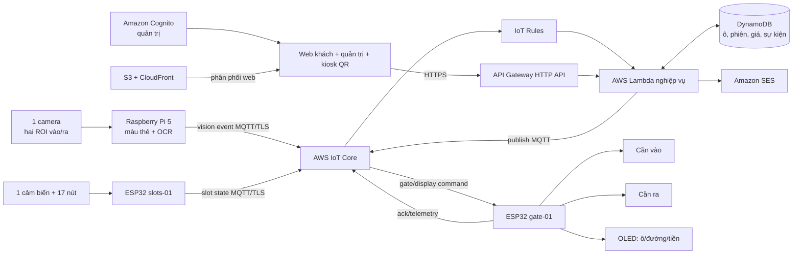

# Kiến trúc hệ thống Smart Parking

Tài liệu này chốt thiết kế **MVP đồ án**. Sơ đồ bãi ở [parking-layout.md](parking-layout.md), nghiệp vụ ở [use-cases.md](use-cases.md), giao thức ở [mqtt-contract.md](mqtt-contract.md) và [api-contract.md](api-contract.md).

## 1. Quy mô và quyết định chính

- Một bãi mô hình **2 tầng × 3 hàng × 3 ô = 18 ô**. ID ô: `F1-A1` đến `F2-C3`.
- Một Raspberry Pi 5 và một camera nhìn được **hai vùng làn vào/ra**. Thẻ xanh là yêu cầu vào, thẻ đỏ là yêu cầu ra; màu chỉ hợp lệ khi xuất hiện đúng vùng làn. Pi OCR biển số tại chỗ.
- Một ESP32 `gate-01` điều khiển **hai servo/cần chắn** và một OLED chỉ dẫn.
- Một ESP32 `slots-01` đọc **một cảm biến thật ở F1-A1** và **17 nút bấm** đại diện 17 ô còn lại. Mỗi lần bấm đảo trạng thái trống/có xe của một ô; trạng thái giả lập được lưu vào NVS.
- Một web app responsive dùng chung. Khách xem sơ đồ công khai và trang chỉ dẫn theo QR phiên; quản trị đăng nhập để xem biển số, phiên đỗ, tính phí và điều khiển thủ công.
- **Email qua Amazon SES** là kênh thông báo của MVP. Khách chọn nhập email cho **từng lượt**; hệ thống không tự dùng email từ lượt cũ. Không cần tài khoản khách.
- Tính phí theo bảng giá mô phỏng, xác nhận thu tiền thủ công. Không tích hợp cổng thanh toán trong MVP.
- Dữ liệu định danh gồm biển số, email và ảnh nếu bật lưu ảnh có hạn truy cập **10 ngày kể từ khi thu thập**; job dọn chạy theo giờ để xóa vật lý quanh mốc này. Demo mặc định không lưu ảnh lên cloud.

## 2. Sơ đồ đầu cuối

**Kết nối internet:** Pi và hai ESP32 dùng Wi-Fi chung; mỗi thiết bị có AWS IoT Thing, certificate và policy riêng. Thiết bị không gọi trực tiếp SES/DynamoDB. Chỉ backend/Lambda phát lệnh điều khiển.

**Kiosk QR:** mở web app ở chế độ kiosk trên laptop/tablet có sẵn hoặc màn hình HDMI gắn Pi. Web hiển thị QR riêng cho phiên vừa được gán ô. OLED 128×64 trên ESP32 chỉ hiện chữ ngắn, không dùng làm nơi quét QR.

## 3. Thành phần phần mềm

| Thành phần | Chạy ở đâu | Chức năng |
|---|---|---|
| Vision service | Pi 5 | Chụp khung hình, phân vùng hai làn, nhận màu thẻ, OCR biển số, chống phát lặp khung hình |
| Gate firmware | ESP32 `gate-01` | Nhận lệnh có hạn, điều khiển 2 servo độc lập, cập nhật OLED, gửi ACK/trạng thái |
| Slot firmware | ESP32 `slots-01` | Đọc ToF cho F1-A1; đọc 17 nút qua GPIO expander; debounce; phát thay đổi/snapshot |
| Business service | Lambda | Dedupe sự kiện, mở/đóng phiên, gán ô nguyên tử, tính phí, phát lệnh, tạo QR token, gọi SES |
| Public web | S3 + CloudFront | Sơ đồ 18 ô ở mức tổng quan; trang QR phiên có lộ trình và ô nhập email |
| Admin web | Cùng web app | Danh sách phiên, cảm biến, cảnh báo, phí, xác nhận thu tiền/xe qua cổng |
| API | API Gateway HTTP API + Lambda | REST cho web; xác thực admin và token QR |
| Database | DynamoDB | Ô, phiên đỗ, token phiên, cấu hình giá, event id và command id đã xử lý |
| Quan sát/chi phí | CloudWatch + AWS Budgets | Log lỗi và cảnh báo chi phí |

**AWS tối thiểu để demo:** IoT Core, IoT Rules, Lambda, API Gateway, DynamoDB, SES, S3/CloudFront cho web, Cognito cho admin/kiosk, EventBridge Scheduler cho việc dọn dữ liệu, CloudWatch và Budgets. RDS, SQS, EventBridge event bus, Rekognition và SMS là **mở rộng có điều kiện**, không cần triển khai để đạt các use case MVP. DOCX gốc liệt kê nhiều dịch vụ và mức Free Tier; mức này thay đổi theo thời điểm/vùng, nên không coi đó là cam kết chi phí.

## 4. Nguồn sự thật và trạng thái

| Dữ liệu | Nguồn sự thật | Ghi chú |
|---|---|---|
| Xe xuất hiện/biển số | Pi event + xác nhận nghiệp vụ | OCR thấp → quản trị xử lý |
| Trạng thái có xe tại ô | ESP32 slots, có `source=sensor` hoặc `button` | Sau 90 giây không có snapshot, chuyển `UNKNOWN` |
| Ô đã cấp cho xe | Backend | `RESERVED` không đồng nghĩa `OCCUPIED` |
| Trạng thái cần chắn | ESP32 gate telemetry | Lệnh đã gửi chưa có nghĩa cơ cấu đã mở |
| Phí/đã thu tiền | Backend + thao tác quản trị | Phí demo, không xác thực thanh toán ngân hàng |

Trạng thái ô: `AVAILABLE`, `RESERVED`, `OCCUPIED`, `UNKNOWN`, `OUT_OF_SERVICE`. Chỉ `AVAILABLE` và dữ liệu mới được xét để gán. Backend ghi điều kiện nguyên tử khi giữ ô để hai xe không nhận cùng ô. Hết 5 phút chưa có trạng thái có xe, backend giải phóng đặt ô và báo quản trị.

## 5. Chọn ô và hướng dẫn

Lối đi ở [parking-layout.md](parking-layout.md) được mô hình thành đồ thị. Với 18 ô, xếp ưu tiên theo khoảng cách đường đi từ cổng vào: tầng 1 trước, hàng A rồi B rồi C, sau đó tầng 2; nếu có ưu tiên đặc biệt thì cấu hình lại trọng số. Chọn ô `AVAILABLE` và không bị `RESERVED`, giữ ô nguyên tử, sinh `route_steps` để OLED, QR và email hiển thị cùng một nội dung.

Khi cảm biến/nút của ô được gán chuyển thành `occupied=true`, phiên sang `PARKED`. Nếu ô khác chuyển có xe, quản trị được cảnh báo sai ô; không tự chuyển phiên sang ô mới.

## 6. Email và QR theo từng lượt

1. Gán ô thành công → backend tạo `session_id` và `claim_nonce` ngẫu nhiên ít nhất 128 bit, ký token QR bằng HMAC với hạn 15 phút. Kiosk lấy URL HTTPS `/s/{token}` từ API và hiển thị QR lớn; raw token không cần lưu trong database.
2. Khách quét QR, xem ô/lộ trình ngay, có thể nhập email và đồng ý nhận **email hướng dẫn của lượt này**. Form không yêu cầu tài khoản hoặc biển số.
3. API giới hạn gửi một email hướng dẫn mỗi phiên; SES chấp nhận yêu cầu gửi tới email vừa nhập. Quản trị có thể sửa/resend có ghi log nếu nhập sai.
4. Không nhập email: OLED và kiosk vẫn chỉ ô/lộ trình; không gửi thư.
5. Lượt sau tạo QR/token mới. **Không lưu liên kết biển số → email** để tự gửi những lần sau; đây là quyết định phù hợp yêu cầu “mỗi lượt nhập email mới”.

Link QR không chứa biển số/email. Màn hình công khai chỉ hiện ô, đường và mã phiên rút gọn. Sau 15 phút token hết quyền thêm email. Nếu cần xem lại lộ trình, quản trị cấp lại token mới cho phiên còn hoạt động.

## 7. Tính phí và kết thúc phiên

Bảng giá ví dụ để demo (có thể sửa trong admin): dưới 15 phút: 0 ₫; đến 60 phút: 10.000 ₫; mỗi giờ tiếp theo bắt đầu: +5.000 ₫. Backend lấy thời điểm xe **yêu cầu ra** làm `charge_end_at` để khóa số tiền. Phiên 0 ₫ có `NO_CHARGE`; phiên có phí cần quản trị ghi nhận `PAID_CASH` hoặc `WAIVED` trước khi mở cần ra. `exit_confirmed_at` chỉ đánh dấu xe đã qua cổng. Web/OLED hiện số tiền; không có giao dịch thanh toán thật.

Do cấu hình phần cứng hiện tại **không có cảm biến xác nhận xe qua cần**, ESP32 chỉ báo cần đã mở/đóng. Quản trị bấm “Xác nhận xe đã ra” trên web (hoặc mock event trong demo) để đóng phiên. Ô chỉ về `AVAILABLE` sau khi cảm biến/nút báo trống; nếu hai tín hiệu mâu thuẫn, hiển thị cảnh báo.

## 8. Lưu dữ liệu và bảo vệ truy cập

- Pi xử lý khung hình trong RAM; mặc định không upload ảnh. Biển số chuẩn hóa, email, token QR và sự kiện nhận diện có hạn truy cập tối đa 10 ngày tính từ lúc thu thập. Xóa email/token khi phiên đóng nếu không cần tra cứu.
- Job purge chạy mỗi giờ, ưu tiên xóa dữ liệu từ mốc 9 ngày 23 giờ để có dư địa trước hạn 10 ngày; báo lỗi nếu job thất bại. DynamoDB TTL chỉ dùng cho item có thể xóa toàn bộ; Lambda xóa riêng thuộc tính định danh khỏi phiên cần giữ số liệu phí. API từ chối đọc dữ liệu quá hạn ngay tại mốc 10 ngày vì TTL có thể xóa trễ.
- Bản ghi tài chính còn cần cho báo cáo được giữ dưới dạng **không có biển số, email, ảnh hoặc token**.
- Khách chỉ thấy sơ đồ chung và dữ liệu phiên trong token của mình; quản trị đăng nhập Cognito. IoT certificate và IAM role cấp quyền tối thiểu. Không commit khóa, certificate hoặc email thật.

## 9. Giới hạn cần trình bày trong demo

- Một camera cho hai làn chỉ khả thi nếu bố trí góc nhìn, ánh sáng và độ phân giải biển số đạt yêu cầu. Nếu không đạt, demo từng làn theo lượt và giữ nguyên schema `lane_id`; bổ sung camera là nâng cấp sau.
- 17 ô do nút bấm mô phỏng không chứng minh được phát hiện xe ngoài thực tế.
- OLED hiển thị chỉ dẫn ngắn; QR cần màn hình kiosk lớn hơn. Kiosk có thể là laptop/tablet sẵn có.
- Không có cảm biến qua cổng, nên bước xác nhận xe ra cần quản trị.

## Tài liệu AWS

- [AWS IoT Core và MQTT](https://docs.aws.amazon.com/iot/latest/developerguide/mqtt.html)
- [Amazon SES: gửi bằng API](https://docs.aws.amazon.com/ses/latest/dg/send-email-api.html)
- [Amazon SES: điều kiện sandbox](https://docs.aws.amazon.com/ses/latest/dg/request-production-access.html)
- [DynamoDB TTL](https://docs.aws.amazon.com/amazondynamodb/latest/developerguide/TTL.html)
